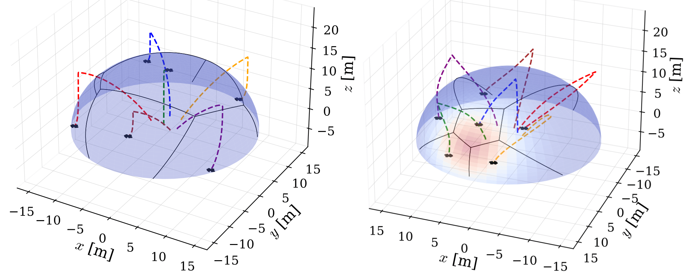

# Hemisphere Coverage

Hemisphere Coverage is a ROS 2 package implementing **hemispherical coverage control** for teams of multirotors using **spherical Voronoi partitioning**, **geodesic motion**, and optional **Gaussian density weighting**.  
The node computes optimal viewpoints on a hemisphere and commands a swarm of PX4-controlled UAVs through ROS 2 Offboard velocity setpoints.

This framework supports **real-time multi-UAV coordination**. Robots autonomously distribute themselves over a hemispherical surface, enabling applications such as surveillance, inspection, environmental monitoring, and distributed sensing.

---

## Methodology Overview

The coverage computation relies on a **spherical Voronoi diagram**, generated through an adaptation of **Fortune’s sweep-line algorithm** to a spherical surface.  
This provides an overall **O(n log n)** complexity for Voronoi region generation, ensuring scalability as the number of UAVs increases.

The Voronoi implementation is conceptually inspired by the approach described here:  
https://whenitsdone.org/2014/07/29/map-generation-on-spherical-planet-part-i/

---

## What This Package Does

### Hemispherical Coverage Control
Each drone is assigned a region on the hemisphere via the spherical Voronoi diagram and moves along geodesics toward its region centroid, ensuring optimal viewpoint distribution.

### PX4-Integrated Swarm Control
The package publishes **PX4-compatible velocity commands** (`geometry_msgs/TwistStamped`) to drive multiple drones in Offboard mode.

### Gaussian-Weighted Coverage
In addition to uniform coverage, the system can bias drone distribution using a **Gaussian density model**, causing agents to converge toward areas of higher importance on the hemisphere.

---

## Example Simulation

The following figure illustrates both uniform and Gaussian-biased coverage simulations:



---

## Requirements

- ROS 2 (tested on Humble)
- Dependencies:  
  `rclcpp`, `nav_msgs`, `geometry_msgs`, `tf2_*`, `std_srvs`, `px4_msgs`, `hemisphere_interfaces`, Eigen3  
- C++17 compiler

---

## PX4 Integration (Offboard)

This package integrates with PX4 through the ROS 2–PX4 Offboard bridge.

### Published Setpoints
- `/<uav_name>/command/setVelocityAcceleration` → primary Offboard velocity control  
- `/<uav_name>/command/setPose` → optional pose reference  

The node emits standard ROS 2 geometry messages, which PX4 consumes through its Offboard interface.

---

## Build

```bash
cd <ros2_ws>
colcon build --packages-select hemisphere_coverage
source install/setup.bash
```

---

## Configuration

Default configuration: `config/hemisphere_config.yaml`  
Geometric tuning: `config/coverage_geometric.json`

### Key Parameters

| Parameter | Description |
|----------|-------------|
| `uav_name` | UAV namespace (e.g., Drone1) |
| `uav_id` | Numeric drone ID |
| `neighbors` | Number of neighbor odometry topics |
| `geometric` | Enables uniform hemisphere coverage |
| `gaussian` | `[x, y, z, sigma]` parameters for Gaussian density bias |
| `velocity_control` | Enables PX4 velocity Offboard mode |
| `pid_yaw.*` | Yaw controller parameters |
| `hemi.cx, cy, cz` | Hemisphere center coordinates |

---

## Node Interfaces

### Subscriptions
- UAV odometry  
- Neighbor UAV odometry  
- Gaussian parameters  
- Hemisphere center/angles  
- Mission/state commands  

### Publications
- Velocity setpoints for PX4 Offboard mode  
- Pose setpoints  
- UAV mission/coverage state  

### Services
- `/<uav_name>/setGaussian` — updates the Gaussian density model  

---

## Software Components

- **hemisphere_coverage node**  
  ROS 2 interface, PX4 Offboard control loop, parameter handling.

- **Coverage core**  
  Spherical Voronoi construction, centroid computation (geometric and Gaussian-weighted), geodesic motion generation.

- **Configuration assets**  
  YAML/JSON files for runtime tuning.

---

## Project Scope

This package contributes to a broader research effort involving:
- Multi-agent hemispherical coverage  
- Distributed control and optimization  
- Swarm robotics with PX4-based aerial vehicles  
- Density-biased view planning via Gaussian fields  
- Real-time control architectures for UAV teams  

The methodology has been validated in simulation and is compatible with real PX4 platforms.

---

## License

This repository is provided for research and development purposes.